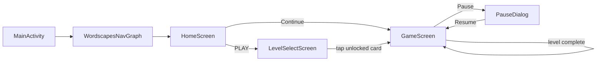
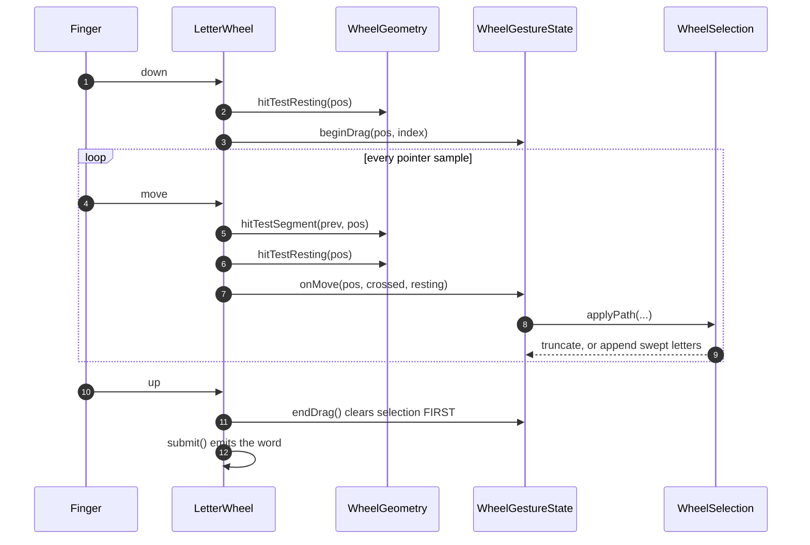

# Wordscapes-style Word Puzzle

An Android word puzzle: swipe letters on a circular wheel to spell words and
fill a crossword grid. Kotlin, Jetpack Compose, single Activity, MVVM.

> Playable end to end across all 15 levels, with cross-session progress, a
> pause menu and a micro-interaction pass. Gesture and lifecycle behaviour has
> been verified by hand on a physical device, and recomposition measured rather
> than assumed. [Known limitations](#known-limitations) is deliberately honest
> rather than aspirational.

---

## Build and run

```bash
./gradlew :app:installDebug        # onto a connected device
./gradlew :app:testDebugUnitTest   # 94 JVM unit tests, no device needed
./gradlew :app:assembleRelease     # minified, shrunk and signed
```

The release build is signed from `keystore.properties` at the repo root, which
is gitignored, with the keystore itself kept outside the repo. When that file is
absent the release build stays *unsigned* rather than failing, so the project
can be cloned and assembled without a key.

Release differs from debug in ways worth knowing: R8 minification and resource
shrinking are on, so `proguard-rules.pro` carries keep rules for the
kotlinx.serialization generated serializers. Those are reached reflectively, so
without them R8 strips them and `levels.json` parsing fails at runtime while
the build succeeds. The release APK has been installed and played through to
confirm it.

Requires JDK 17. Toolchain is pinned to AGP 9.2.1 / Gradle 9.4.1 — AGP 9.2 lists
Gradle 9.4.1 as both its minimum and its default, and 9.2.1 is the ceiling the
development Android Studio supports. `minSdk` 24, `compileSdk`/`targetSdk` 36.

Note that AGP 9 provides Kotlin itself, so there is deliberately no
`kotlin-android` plugin. Kotlin *compiler* plugins (Compose, serialization) are
still applied explicitly.

---

## Architecture

```
ui/
  home/          HomeScreen
  levelselect/   LevelSelectScreen + ViewModel
  game/          GameScreen, GameViewModel, GameUiState
    wheel/       WheelGeometry, WheelSelection, WheelGestureState, LetterWheel
    grid/        CrosswordGrid
  pause/         PauseDialog
  navigation/    Destination, NavGraph
  theme/         Color, Type, Theme
domain/
  model/         Level, PlacedWord, GridCell, WordResult, GameRules, GameProgress
  repository/    LevelCatalog, WordLookup, ProgressStore   (interfaces)
  usecase/       ValidateWord
data/
  level/         LevelRepository, LevelJsonSource, LevelMapper, LevelDto
  dictionary/    DictionarySource
  progress/      ProgressDataStore
di/              AppModule, DispatcherModule, RepositoryModule
tools/           level generator — build tooling, not part of the app
```

**Dependencies point inwards.** `domain/` declares `LevelCatalog` and
`WordLookup` as interfaces; `data/` implements them; Hilt binds them in
`RepositoryModule`. Both concrete implementations need an Android `Context` to
read assets, so depending on the interfaces is what lets `ValidateWord` and
`GameViewModel` be tested on the JVM with a two-line fake instead of under
Robolectric.

`GameRules.MIN_WORD_LENGTH` lives in `domain/` for the same reason. An earlier
draft had `ValidateWord` importing it from the wheel package, which inverted the
direction and would have made the domain layer unusable without the UI.

**One `StateFlow<GameUiState>` per screen ViewModel.** A screen sees a single
immutable snapshot rather than several flows it has to combine, which removes a
whole class of bug where one flow has updated and another has not.

---

## Walkthrough: launch to auto-advance

Read this first if you are opening the repo cold. It follows one path all the
way through — app start, into a level, one swipe, and out the other side.



Every arrow above is decided in **one file**, `ui/navigation/NavGraph.kt`.
Screens report what happened through callbacks and never touch the
`NavController`, so back-stack policy has a single home.

### 1 · Launch

| | |
|---|---|
| `WordscapesApplication` | `@HiltAndroidApp` — builds the DI graph |
| `MainActivity.onCreate` | `enableEdgeToEdge()`, then `setContent { WordscapesTheme { WordscapesNavGraph() } }` |

That is the entire Activity. Everything below is Compose.

### 2 · Home

`HomeScreen()` takes `HomeViewModel` via `hiltViewModel()`, reads state with
`collectAsStateWithLifecycle()`, and hands rendering to the stateless
`HomeContent()` — split so `@Preview` works.

`HomeViewModel.init` collects `ProgressStore.progress` and derives
`continueLevelId` from `GameProgress.nextPlayableLevelId()`.

PLAY → `navigate(Destination.LevelSelect)`.

### 3 · Level Select

`LevelSelectViewModel.init` reads the ordered level ids **once** via
`LevelCatalog.getLevels()`, then **collects** `ProgressStore.progress` for the
ViewModel's lifetime, mapping each id to a `LevelCard(id, isUnlocked,
isCompleted)`.

Collecting rather than reading once is why finishing a level updates this list
with no coupling between screens.

Tap an unlocked card → `navigate(Destination.Game(id))`.

### 4 · Entering a level

`GameViewModel.init` launches two coroutines:

1. **`loadLevel()`** — reads `levelId` from `SavedStateHandle`, calls
   `LevelCatalog.getLevel()` and `nextLevelId()`, restores revealed and bonus
   words via `restoredRevealed()` / `restoredBonus()`.
2. **A consumer loop** draining the `submissions` channel.

First call triggers the only real I/O:

`LevelRepository.getLevels()` (mutex-guarded, cached for the process)
→ `LevelJsonSource.loadLevels()` (reads `assets/levels.json`)
→ `LevelMapper.toDomain()` — **this is where the grid is derived**, validating
every placement and building `Level.cells`, throwing `LevelFormatException` on
anything malformed.

`GameScreen` then renders `CrosswordGrid`, `FeedbackBanner`, and `LetterWheel`.
Gesture state lives in a `remember { WheelGestureState() }` — deliberately not
in the ViewModel.

### 5 · One swipe



Two geometry calls per sample, for two different questions. `hitTestSegment`
uses the generous reach radius and answers *what did the path touch*.
`hitTestResting` uses the strict radius and answers *what is the finger sitting
on* — which is the only input to retrace.

`selection` and `pointer` are `mutableStateOf` read inside
`drawWithCache { onDrawBehind { } }`, so a move invalidates the draw phase only —
no recomposition, no geometry recompute.

### 6 · Validation

`submitWord()` does nothing but `submissions.trySend(word)`. Non-blocking, so
the wheel never waits on validation, and the buffer absorbs rapid swipes.

The single consumer runs `handleSubmission()`:

```
ValidateWord(word, level, revealed, bonus)
    length -> isSpellableFrom() -> grid match -> already found -> WordLookup
    returns GridWord | BonusWord | AlreadyFound | Invalid
```

Then `_uiState.update { }` adds the revealed index or bonus word and bumps
`submissionId`, and `persist()` writes both sets into `SavedStateHandle`.

### 7 · Completion and auto-advance

`handleSubmission` compares `before.isComplete` against the new value. On that
**transition** — not on the state — it calls `ProgressStore.markCompleted()`,
which reaches Level Select and Home through their collectors.

`isComplete` flipping re-runs `LaunchedEffect` in `GameScreen`, which delays,
then calls `onAdvanceToLevel(next)`, or `onFinishedFinalLevel()` when
`nextLevelId` is null.

`NavGraph` handles it:

```kotlin
navigate(Game(nextId)) {
    popUpTo(destination) { inclusive = true }   // replace, do not push
    launchSingleTop = true
}
```

The new entry gets a fresh `GameViewModel` and a fresh `SavedStateHandle`, and
the cycle restarts at step 4.

---

## Swipe logic

This is the most interesting part of the codebase, and the part with the
subtlest failure modes. Four pieces:

### 1. `WheelGeometry` — pure, cached, testable

Letter positions are a pure function of available size and letter count. No
Compose runtime beyond `Offset`, so it is fully unit-tested. Computed once per
size change via `Modifier.drawWithCache`, whose outer block re-runs only on size
change while the `onDrawBehind` lambda runs per frame. With a plain `Canvas` the
trig and glyph measurement would recompute on every frame of every drag.

Caching matters less for the cost than for **stability**: hit-test results must
not shift under a finger mid-drag because a recomposition recalculated a radius
slightly differently.

### 2. Two radii: generous to reach, strict to undo

The touch target is **1.6× the drawn circle** (`HIT_RADIUS_MULTIPLIER`). A
target matching the visual reads as unresponsive: a fingertip contact patch is
roughly 9 mm across but the system reports a single point somewhere inside it,
so a player aiming dead centre often produces a point outside a matched-size
hitbox.

Because inflated radii overlap, `hitTest` returns the **nearest** centre rather
than the first match. First-match would make results depend on list order, so a
finger in the overlap between letters 2 and 3 would always resolve to 2 — which
reads as the wheel favouring one side.

There is a second, much tighter radius — `retraceRadius`, 0.85× the *drawn*
circle — used only to decide whether the finger is **resting on** a letter.
Adding a letter and undoing one are not symmetric operations: reaching should
be forgiving, because a false negative merely fails to add something, whereas
undoing should be deliberate, because a false positive destroys work already
done. Sharing one radius caused a bug found on device, where drawing forward
past an already-selected letter put the finger inside its generous hit circle
without ever visibly touching it, and the word silently truncated.

### 3. Segment hit testing, not point sampling

Pointer events are sampled, not continuous. A fast flick across the wheel may
produce only five or six samples for the entire drag, so a letter sitting
between two consecutive samples is silently skipped and the player sees a swipe
they clearly made produce the wrong word. Inflating the hitbox helps but cannot
fix it — the faster the drag, the wider the gaps.

`hitTestSegment` solves it exactly rather than by sub-sampling: for each letter,
take the perpendicular distance from its centre to the line segment between
consecutive pointer samples. Within `hitRadius` means the finger passed through
it, however sparse the sampling. Results are ordered by where along the segment
the closest approach occurred, so one segment crossing three letters returns
them in travel order.

### 4. Selection rules, and one bug worth reading about

`WheelSelection` is pure logic with no Compose or gesture dependency, so the
rules get real tests instead of thumb-verification. Three cases:

| Entering | Result |
|---|---|
| An unselected letter | append |
| The letter immediately before the current last | pop the last (backtrack) |
| Any other already-selected letter | ignore |

The third case covers two things that both must be no-ops: re-entering the
*current* letter, which happens constantly because a resting finger emits a
stream of move events (appending each would spell `SSSSS`), and crossing back
over the middle of your own trail, since a letter cannot be reused in a word.

**Whether a gesture is a retrace is decided by where the finger lands.** This
rule exists because of a bug found in ordinary play. On a five-letter wheel `C S E A R`,
swiping R → A → C means the hop from A to C spans 144° — and R sits directly
between them. A straight chord clears R's hit circle by about 2%, but nobody
swipes straight chords; fingers arc along the rim, and that arc passes through
R. R being the second-to-last selection, the old rule read it as a retrace and
popped A, so `R-A-C-E` silently became `R-C-E` and reported "not a word".

Retracing is a statement about **position, not movement**: if the finger is
resting on a letter earlier in the word, the word truncates to end there.
Distance is irrelevant, so a slow one-letter retrace and a fast flick back
across three behave identically. Otherwise the finger is drawing forward and
swept letters are appended if new, ignored if not — nothing is ever undone.

Resting inside the *last* letter counts as forward drawing, not retracing.
That distinction fixed a second on-device bug where the word's second letter
kept dropping: adjacent hit circles overlap, so the moment a thumb began
leaving letter two the segment grazed letter one, and letter one was the
trigger to undo.

### Submission ordering

On pointer up the selection is cleared **before** the word is emitted, so
validation and its animations run against an already-empty wheel. A second swipe
starting immediately cannot append onto the previous word.

Submissions are then serialised through a `Channel` consumed by a single
coroutine in `GameViewModel`. Validation suspends on the dictionary lookup, so
two rapid swipes would otherwise both read the same revealed-set snapshot and
resolve the same word as a fresh find twice. `submitWord` stays non-blocking so
the wheel never waits on validation, and an unlimited buffer absorbs a burst
rather than dropping its middle.

### Rendering the tracking line

Segments join consecutive selected centres, plus one live segment to the **raw**
pointer position. No smoothing or interpolation on that live segment — easing
there reads as input lag even at a few milliseconds.

---

## Level data

`app/src/main/assets/levels.json`:

```json
{
  "id": 1,
  "letters": ["N", "I", "L", "S", "K"],
  "gridWidth": 7,
  "gridHeight": 6,
  "words": [
    { "word": "LINKS", "row": 2, "col": 1, "horizontal": true },
    { "word": "SILK",  "row": 0, "col": 3, "horizontal": false }
  ]
}
```

`letters` is the wheel set. Every entry in `words` is an anagram subset of it.

**Cell occupancy and intersections are derived at load time, never stored.**
`LevelMapper` rebuilds the grid while validating every placement against every
other: spellable from the wheel, inside the declared bounds, agreeing at
intersections, no duplicate words. A malformed level throws
`LevelFormatException` naming the level id at startup, instead of producing an
unwinnable grid that only reveals itself three words into play.

`GridCell` carries a **set** of word indices, not one, so revealing a word also
fills in the shared letters of every word crossing it.

### Generation (`tools/`, not part of the app build)

1. **Source vocabulary** — SCOWL via Debian `wamerican` (see `WORDLIST-LICENSE.txt`).
2. **Content blocklist** (`blocklist.txt`, 280 entries) — a spell-checker list is
   complete, not curated. Unfiltered, the first run placed `RAPE` in level 1
   because it is a perfectly valid sub-anagram of "paper".
3. **Two-tier vocabulary.** "Is this a real word?" and "should a player be
   *required* to find this to progress?" are different questions.
   `build_common_list.py` filters by corpus frequency (`wordfreq`, Zipf ≥ 3.2) to
   produce the grid-eligible list. The cut sits cleanly between ASTIR 1.60,
   SITAR 2.41, SEPTA 2.70 and STAIR 3.26, PASTE 3.91, ARTS 4.70. Bonus words
   still resolve against the full list — an obscure word you happened to try is
   a reward, never a blocker.
4. **Placement** — greedy with backtracking on shared letters, biased toward
   compact bounding boxes. Without that bias grids drift into long sparse chains
   that are legal but read as scattered letters rather than a crossword.
5. **Validation** — `validate_levels.py` re-derives everything from the emitted
   JSON without importing the generator. A validator sharing generator code only
   proves the generator is self-consistent.

```bash
python3 tools/generate_levels.py     # emits levels.json + dictionary.txt
python3 tools/validate_levels.py     # independent structural check
```

`dictionary.txt` ships only words reachable from some level's wheel — 400
entries, ~2 KB, rather than a 600 KB lexicon nobody can spell from.

---

## State retention

Two layers, split by what is worth preserving:

- **`SavedStateHandle`** holds revealed grid words and found bonus words as
  primitive arrays, written on every change. A level interrupted by process
  death resumes intact.
- **Gesture state is deliberately in neither.** In-progress selection and pointer
  position live in `WheelGestureState` inside the composable. Nobody wants a
  half-drawn swipe restored after their phone was killed in the background, and
  keeping it out means no gesture state ever needs serialising.
- **DataStore** holds cross-session progress — which levels are completed.
  Only completion is stored; which levels are *unlocked* is derived from that
  plus the level ordering. Two persisted fields that must agree are two fields
  that can disagree, and derivation cannot drift. `ProgressStore` exposes a
  `Flow`, so finishing a level in Game updates Level Select and Home without
  any screen knowing the others exist.

**Pause is a `dialog<T>` destination, not a `composable<T>`.** It renders on top
of Game rather than replacing it, so Game stays composed, its ViewModel and
SavedStateHandle stay alive, and Back dismisses only the dialog. Built as a
screen, Back would pop the player out of the level and pausing would cost them
their board. Restart works by replacing the Game entry — a new back-stack entry
gets a new SavedStateHandle, so progress clears as a consequence of navigation
rather than through a `reset()` method with exactly one caller.

**Back-stack policy lives entirely in `NavGraph`.** Screens report what happened
through callbacks and the graph decides where that leads. Auto-advance navigates
to the next level while popping the current one inclusively — replacing rather
than pushing. Pushing would stack one `Game` entry per level completed, so a
player who finished five levels and pressed Back would walk backwards through
five already-solved boards.

---

## Verified on hardware

Unit tests cover logic; these were run by hand on a physical device, because
neither gesture feel nor lifecycle behaviour is reachable from the JVM.

**Gesture (8 cases).** Rapid consecutive swipes; second finger mid-drag;
drag off-screen and back; release away from a letter; release with nothing
selected; retrace past the start letter; the same word submitted twice in
quick succession; rotation mid-drag.

Three bugs came out of this pass, all one root cause — a single hit radius
shared by operations with asymmetric costs. See the swipe-logic section.

**Lifecycle (6 cases).** Rotation on every screen, including mid-word;
backgrounding and return, including from the pause dialog; the same again with
"don't keep activities" enabled; `am kill` while backgrounded, returning via
Recents; `am force-stop` and relaunch; back at every node including rapid
repeated presses and presses during transitions; completing a level and going
back; completing the final level.

The two kill cases are deliberately different and both behave correctly. A
system kill restores the board, because saved instance state survives.
A user force-stop does not, because the task is torn down — but completed
levels and unlock state survive it, since those live in DataStore. That split
is the entire reason there are two persistence layers.

## Recomposition

Measured on device by logging from a `SideEffect` in each composable — one line
per committed recomposition, skipped compositions produce nothing.

| | 5s continuous drag | 6–7 words submitted |
|---|---|---|
| `LetterWheel` | 1 | **1** |
| `CrosswordGrid` | 1 | 7 |
| `GameScreen` | 3 | 21 |

**The wheel recomposes once, while its parent recomposes 21 times around it.**
Hundreds of pointer samples, a live tracking line and per-letter capture
animations, and composition is never re-entered — every frame is a redraw. That
is what `WheelGestureState`, the `drawWithCache` split and driving the capture
animation from `snapshotFlow` instead of an effect key are all for.

`CrosswordGrid` at 7 is one per submission, which is real work: the revealed set
genuinely changed. `GameScreen` at 3 per submission is the state update, the
feedback auto-clear, and load-time emissions.

Two things this exercise corrected, both worth recording because the wrong
version is the intuitive one:

- An earlier reading of this showed 1 across the board and looked like a
  perfect result. The probe itself was a composable taking a constant `String`,
  so Compose skipped it after the first frame and it silently stopped
  reporting. `@NonRestartableComposable` fixed it. A measurement that agrees
  with your prediction deserves more scrutiny than one that contradicts it.
- `LetterWheel` takes a `List<Char>`, which the compiler treats as unstable, so
  it should in theory be non-skippable and recompose with its parent. It does
  not, because **strong skipping** is on by default in the Kotlin 2.x Compose
  compiler and compares unstable parameters by instance equality. Since
  `letters` is the same instance out of the same `Level`, it skips. Reasoning
  about stability using pre-2.0 rules gives the wrong answer.

No `kotlinx-collections-immutable` refactor was needed. That was checked rather
than assumed.

## Testing

94 JVM unit tests, no device or Robolectric required:

| Area | Tests | Covers |
|---|---|---|
| `WheelSelectionTest` | 21 | append and retrace, path folding, two on-device regressions |
| `WheelGeometryTest` | 27 | layout, spacing, hit radius, segment ordering, degenerate cases |
| `LevelDataTest` | 16 | all 15 shipped levels + 6 negative cases proving validation rejects malformed input |
| `GameViewModelTest` | 18 | loading, submissions, the rapid-duplicate race, saved-state round trip, completion recorded once |
| `ValidateWordTest` | 12 | resolution order and every branch |

Notable: `LevelDataTest` asserts **no unintended letter runs** — two words placed
alongside each other are individually legal but create a perpendicular run
spelling something unenterable, so the grid looks solvable and is not.
`GameViewModelTest` simulates process death by building a second ViewModel from
the same `SavedStateHandle`.

---

## Known limitations

Current and honest.

- **A retracing sample that lands between letters pops nothing.** Minor and
  self-correcting: with the finger in dead space there is no way to tell a
  retrace from a forward sweep, so that sample is a no-op and the next sample
  inside a letter resolves it.
- **No landscape-specific layout.** Rotation neither crashes nor loses state,
  but landscape reuses the portrait composition and the board sits centred with
  empty margins either side. A side-by-side arrangement was scoped and
  deliberately deferred — see the note on the reference product below.

### A deliberate difference from the reference product

Wordscapes itself is portrait-locked — on iOS at least, rotating does nothing.
For a shipped game that is defensible: one layout to design, one to QA, and
nobody plays a word game sideways.

This app deliberately does not lock. Rotation is the cheapest way to exercise
configuration-change handling, and locking it would hide whether that handling
is correct rather than demonstrate it. The cost is that landscape reuses the
portrait composition and looks cramped — see Known limitations — which is the
right trade when the alternative is having no observable evidence that
`SavedStateHandle` and the back stack behave.

Note too that locking would not have avoided the work. "Don't keep activities"
and real process death exercise the same restoration path with no rotation
involved.

## Out of scope

Sound, haptics, currency, hints, daily rewards, tutorials, achievements,
settings, themes, leaderboards, analytics, ads, cloud sync, localisation, and
tablet layouts. Level content quality is not a graded criterion, though it was
worth fixing when level 1 turned out to require ASTIR.
